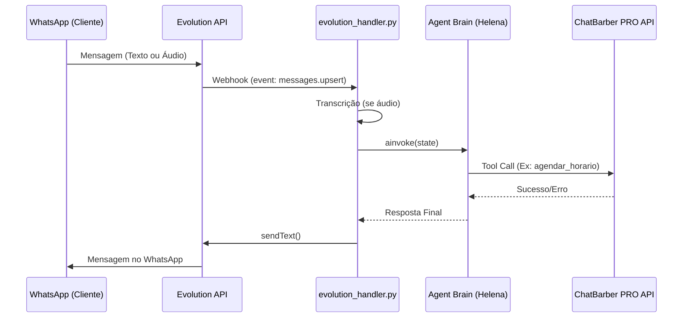

# 🏗 Arquitetura do Sistema

O BarberOS é um sistema multi-tenant projetado para automação de barbearias, integrando IAs agentic com sistemas de gestão legados e modernos.

## 🧱 Componentes Principais

### 1. Engine Agentic (LangGraph)
Localizada em `src/agent/chatbarber_pro_engine.py`. É o núcleo da inteligência.
- **Gráfico de Estados**: Gerenciado pelo LangGraph.
- **Sanitização**: Filtro de mensagens órfãs para evitar erros 400 da OpenAI.
- **Ferramentas (Tools)**: Consultas de unidades, serviços, profissionais e agendamento.

### 2. Integrações (Clients)
Localizadas em `src/integrations/`.
- **ChatBarber PRO**: Cliente unificado seguindo o padrão `/api/v1/{owner_id}/{endpoint}`.
- **Evolution API**: Gateway para WhatsApp que recebe e envia mensagens.

### 3. API Handlers
Localizados em `src/api/routes/`.
- `evolution_handler.py`: Recebe webhooks, transcreve áudios e invoca o cérebro da IA.

## 🔄 Fluxo de Mensagem

## 🛠 Escolhas Técnicas
- **Modelo**: `gpt-4o-mini` (Eficiência e custo para tarefas de agendamento).
- **Backend**: FastAPI.
- **Persistência**: `MemorySaver` para threads de conversa.
